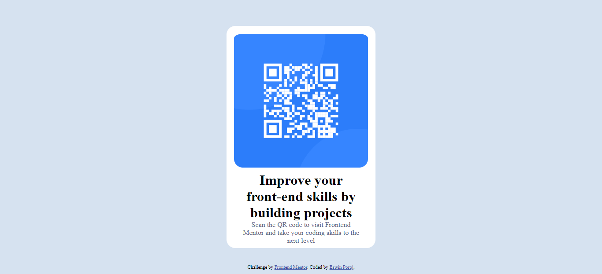

# Frontend Mentor - QR code component solution

This is a solution to the [QR code component challenge on Frontend Mentor](https://www.frontendmentor.io/challenges/qr-code-component-iux_sIO_H). Frontend Mentor challenges help you improve your coding skills by building realistic projects.

## Table of contents

- [Overview](#overview)
  - [Screenshot](#screenshot)
  - [Links](#links)
- [My process](#my-process)
  - [Built with](#built-with)
  - [What I learned](#what-i-learned)
  - [Useful resources](#useful-resources)
- [Author](#author)

## Overview

In this project I only used HTML 5 and CSS, using various concepts such as flexbox, position, etc.

### Screenshot

#### Screenshot Desktop

#### Screenshot Mobile

### Links

- Solution URL: [Add solution URL here](https://your-solution-url.com)
- Live Site URL: [Add live site URL here](https://your-live-site-url.com)

## My process

### Built with

- Semantic HTML5 markup
- CSS custom properties
- Flexbox
- Mobile-first workflow
- [Styled Components](https://styled-components.com/) - For styles

### What I learned

In this project I used several concepts that I had only studied but not practiced. But, this exercise helped me implement it.

### Useful resources

In this project I used GitHub Copilot about two times, to resolve some doubts that arose in the process.

## Author

- Frontend Mentor - [@yEswin-Poroj](https://www.frontendmentor.io/profile/Eswin-Poroj)
- Twitter - [@PorojCastro](https://www.twitter.com/PorojCastro)